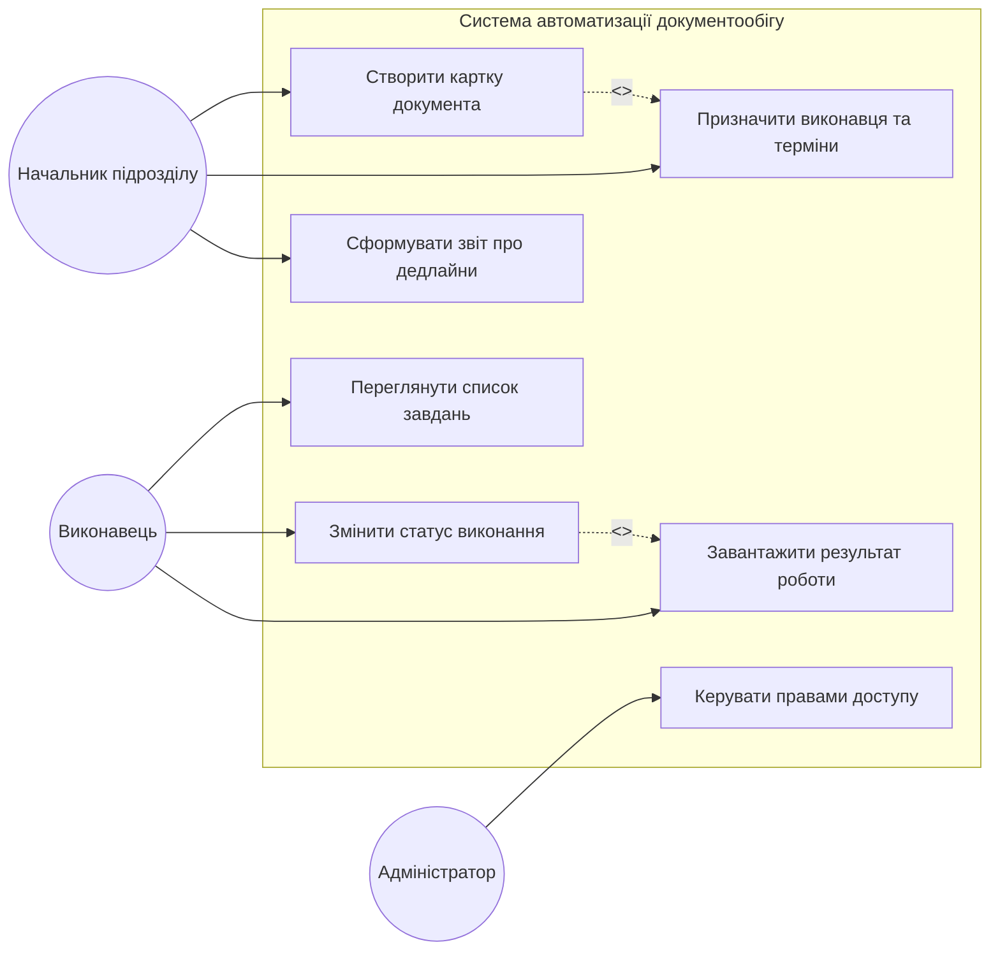
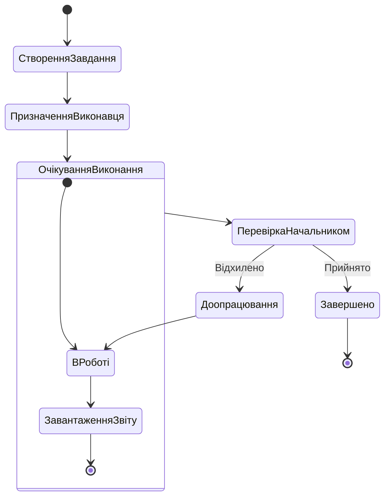
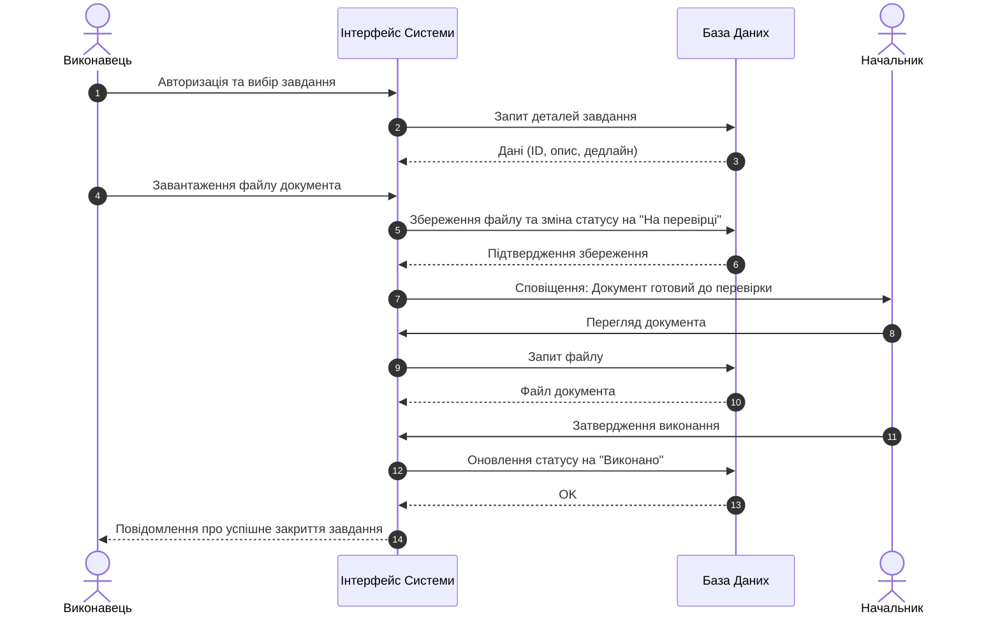

# Practical lesson pz-UML
Побудова повердінкових UML-діаграм для проєктування інформаційних систем

## Тема - Виявлення та аналіз зловмисних скриптів і шкідливого коду у відкритих репозиторіях із застосуванням технологій штучного інтелекту

## 1. Діаграма варіантів використання (Use Case Diagram)

Діаграма варіантів використання визначає межі системи та ролі учасників.

* **Начальник** ініціює процес, створюючи завдання та встановлюючи дедлайни.
* **Виконавець** взаємодіє з системою для отримання завдань та звітування.
* **Адміністратор** забезпечує технічну підтримку та налаштування прав.

Ця діаграма описує функціональність системи з точки зору користувачів (акторів). Основними акторами є Начальник підрозділу (контроль та призначення) та Виконавець (робота з документами).

## 2. Діаграма діяльності (Activity Diagram)

Діаграма діяльності відображає бізнес-процес опрацювання документа: від створення завдання до його успішного завершення або повернення на доопрацювання.

Процес має циклічний характер у разі незадовільної якості виконання. Використано розгалуження (choice) для прийняття рішення керівником.

## 3. Діаграма послідовності (Sequence Diagram)

Ця діаграма демонструє взаємодію між об'єктами системи у часі під час сценарію «Оновлення статусу документа та завантаження звіту».

Діаграма деталізує технічну логіку: як саме дані передаються між користувачем, інтерфейсом та сховищем даних, а також як реалізовано механізм сповіщень.

## Пояснення змісту та зв'язків
### Логічний зв'язок:

* **Use Case** визначає що система робить (наприклад, «Змінити статус»).

* **Sequence** розкриває як цей статус змінюється через взаємодію об'єктів (Виконавець -> Система -> БД).

* **Activity** показує місце цієї дії в загальному життєвому циклі документа.

### Призначення:

* **Use Case:** Для узгодження вимог із замовником.

* **Activity:** Для розуміння бізнес-логіки та маршрутів документа.

* **Sequence:** Для розробників, щоб спроектувати логіку обробки запитів.
